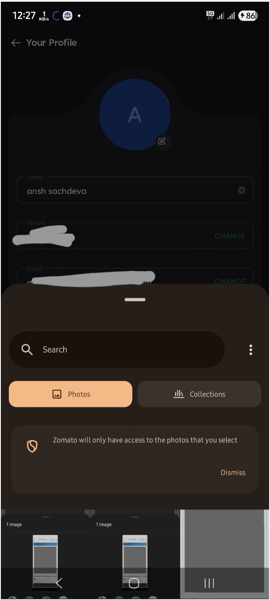
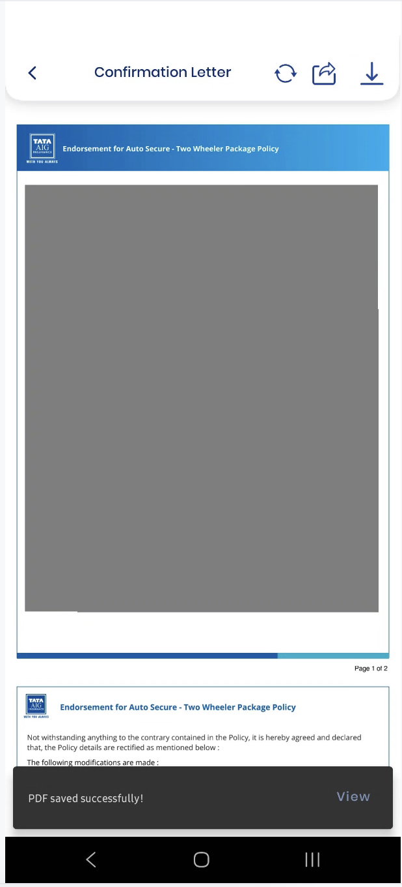
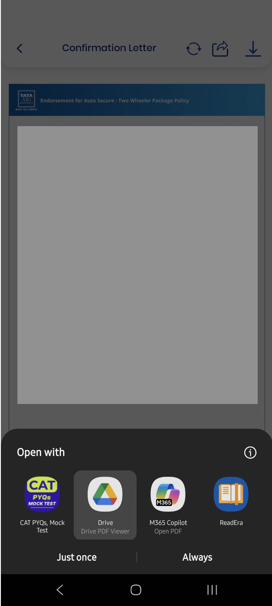
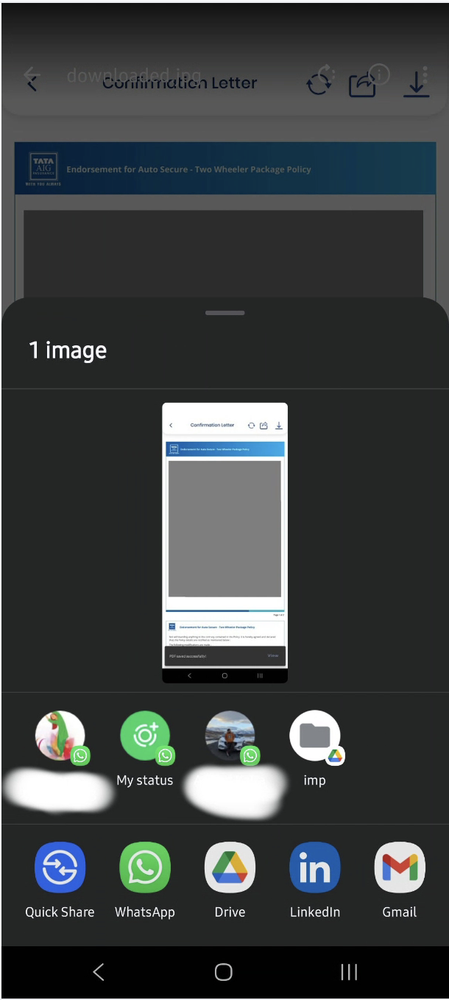
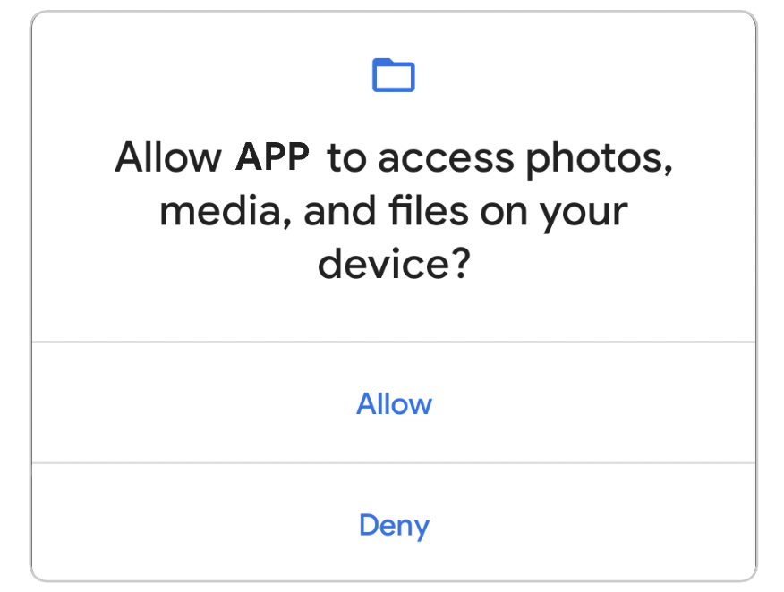
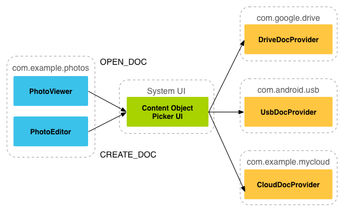

# Stop Requesting Storage Permissions! Building Modern Apps with privacy focused SAF and Media Apis


Android Apps are one of the most common source of data breaches and scams, and if your app is still requesting for `READ_EXTERNAL_STORAGE` or `WRITE_EXTERNAL_STORAGE` permission in 2025, you need to seriously re-think your approach.

## Introduction : Understanding the interaction between Apps and User memory
90% of the apps on play store are doing some kind of read/write/view operation using user's files:

Case 1 : Food Delivery Apps:
- A food delivery app wants to let user pick an image from their memory and render it on screen . This is a case of **"Picking"(i.e Reading) Images From Memory.**.  

Case 2 : Social Media Apps : 
- A famous Job Platform lets users pick image/PDFs etc from user memory and share them as posts to community. This is a case of **"Picking" Images/PDFs/Other Files** From Memory.  
- It also allows Downloading other people's images/PDFs to user memory . This becomes a case of   **Writing Images/PDFs/Other Files** to user's permanent location. 
- Sometimes they also allow immediate viewing("downloaded abc_resume.pdf <u>open</u>"), which would come under **Opening Media Files using User's Apps**. 
- Another most common use case is allowing user to share some media file to other apps . This would come under **Sharing Media Files to other Apps**

Case 3 : Insurance Apps
- Like other apps, an insurance app would allow its user to pick image from system and set it as profile picture : Case of **"Picking"(i.e Reading) Images From Memory.**.
- When a user policy PDF is generated, it is rendered inside the app, but if user wants to quickly access it in their file manager, the insurance apps lets user save this file in memory : Case of **Saving File to User Memory**
- During Claim filing, user should be allowed to preview their submitted documents : Case of **Opening Media Files using User's Apps**.
- On Claim completion, user should be allowed to share their settlement documents directly : Case of **Sharing Media Files to other Apps**

<div style="display: flex; justify-content: center; gap: 10px;">
  
  
  
  
</div>

## The Problem : Requesting Broad memory access  and risking vulnerabilities 

Traditionally, Implementing use cases like these would require storage access runtime permission:  

1. user will click on cta to download/share file
2. the code will trigger a system popup for users to grant `READ_EXTERNAL_STORAGE` &/or `WRITE_EXTERNAL_STORAGE` permission
3. on receiving permission , your app is now a **Security nightmare** , as it now has full access to read/write all the files on user memory:
   - **Overexposed Data** : Even if the app wanted just a single image, it got access to ***all storage***, thereby allowing access to user's private files that had nothing to do with their functionality.
   - **Security Risks** : Malicious apps could steal private files, such as personal documents or private photos.
   - **User Trust Issues** : When users see a vague prompt like “Allow this app to access your photos, media, and files?”, many would blindly declined (blocking functionality), thereby creating a poor user experience and distrust toward apps in general.
   - **System Considerations** : Starting Android R (Sdk version 30), requesting for these permissions have [no effect](https://developer.android.com/reference/android/Manifest.permission#WRITE_EXTERNAL_STORAGE). User will also see a different popup . Moreover, Google discourages the use of these permissions and have begun heavily restricting apps on playstore that raise this permission without a valid reason




## The Solution : Storage Access Framework and Media APIs

[Storage Access Framework (SAF)](https://developer.android.com/guide/topics/providers/document-provider) and media APIs is the Google's response for tackling all the above issues. This framework provides a privacy-first approach to file access, ensuring that apps can work with user files without requiring broad, intrusive permissions:
- **Granular Access Control**: Users explicitly choose which files or folders your app can access through the SAF document picker. This can include files from the device’s storage, other apps (via File Providers), or even cloud storage providers like Google Drive. 
- **Privacy by Design**: Your app receives access only to the files the user selects, rather than unrestricted access to the entire device storage.
- **Flexible Saving Options**: When saving media files, your app can let the user choose the exact location — whether that’s internal storage, an SD card, or a cloud-backed directory — instead of writing files silently in the background.



## Working

Lets dive directly into the code to understand how our apps can utilise the Storage Access Framework and Media Apis to provide a seamless and privacy focused experience

### 1. Reading Files from User memory without Requesting Permissions

Reading a file from user's memory is very simple. User taps on a button, sees a file picker and selects a file. The app receives the file and does its operations on it: render to screen, save to database, etc.   
In terms of code, the operation that has to be performed after the file is picked needs to be defined before hand.


1. Define the filePick launcher and what happens after the file is received : 
```kotlin
    private val getFileFromSystem: ActivityResultLauncher<Intent> = registerForActivityResult(StartActivityForResult()) { result ->
        if (result.resultCode == RESULT_OK) {
            val uri = result.data?.data
            lifecycleScope.launch {
                val file = uri?.toLocalFile(this@XMLActivity) // convert to local file
                updateUi()// handle local file
            }

        }

    }
```
2. on user action, request for file from SAF
```kotlin
val intent = Intent(Intent.ACTION_OPEN_DOCUMENT).apply {
  type = "image/*" //"application/pdf" // "*/*"
  putExtra(Intent.EXTRA_MIME_TYPES, arrayOf("image/*")) // required in some android versions. also good if you set type as */* and want to filter mimetypes
  addCategory(Intent.CATEGORY_OPENABLE)
  addFlags(Intent.FLAG_GRANT_PERSISTABLE_URI_PERMISSION or Intent.FLAG_GRANT_READ_URI_PERMISSION)// optional for our app, but required if you intend to save the  SAF content uris(temporary by nature) in databases
}
getFileFromSystem.launch(intent)
```


**Some Notes**
1. Since the file picker returns a temporary content uri, we cant store it directly in our db as a string. instead we should either consume its bytes directly or save it in a local file in our app's specific memory, so that it can be accessed by app in the long term. 
```kotlin
// converts any uri(content/file) to a local temp file first in cache directory for easy read/write
suspend fun Uri.toLocalFile(context: Context,localFileLocation:File = context.cacheDir): File? {
    val uri = this
    return withContext(Dispatchers.IO) {
        try {
            val fileInfo = FileInfo.fromSAFUri(context,uri)
            val fileName = fileInfo?.nameWithExtension?: "${System.currentTimeMillis()}.bin"
            val tempFile = File(localFileLocation, fileName)
            context.contentResolver.openInputStream(uri)?.use { inputStream ->
                FileOutputStream(tempFile).use { outputStream ->
                    val buffer = ByteArray(8 * 1024)
                    var bytesRead: Int
                    while (inputStream.read(buffer).also { bytesRead = it } != -1) {
                        outputStream.write(buffer, 0, bytesRead)
                    }
                }
            }
            tempFile
        } catch (e: Exception) {
            e.printStackTrace()
            null
        }
    }
}
```
2. Since The file will loose any associated metadata once converted from Content uri to local file uri, you can extract out the information beforehand and store it
```kotlin
data class FileInfo(
    val nameWithExtension: String,
    val extension: String?,
    val mimeType: String?,
    val size: Long?,
    val sizeFormatted: String?,
    val createdOn: Long?,
    val modifiedOn: Long?,
    val originalLocationPath: String?
){
    fun prettyString(): String{
        return buildString {
            appendLine("Name:${nameWithExtension}")
            appendLine("MimeType:${mimeType}")
            appendLine("Path:${originalLocationPath}")
            appendLine("Size:${sizeFormatted}")
        }
    }
    companion object{
        // gets file info for any system uri(content/file). added @SuppressLint("Range") To avoid warnings for column access
        @SuppressLint("Range")
        fun fromSAFUri(context: Context, uri: Uri?): FileInfo? {
            uri?:return null
            val contentResolver = context.contentResolver

            var name: String = "Unknown"
            var size: Long? = null
            var createdOn: Long? = null
            var modifiedOn: Long? = null
            val mimeType: String? = contentResolver.getType(uri)
            var displayPath: String? = null

            val cursor = contentResolver.query(uri, null, null, null, null)
            cursor?.use {
                if (it.moveToFirst()) {
                    val nameIndex = it.getColumnIndex(OpenableColumns.DISPLAY_NAME)
                    val sizeIndex = it.getColumnIndex(OpenableColumns.SIZE)
                    val dateAddedIndex = it.getColumnIndex(MediaStore.MediaColumns.DATE_ADDED)
                    val dateModifiedIndex = it.getColumnIndex(MediaStore.MediaColumns.DATE_MODIFIED)

                    if (nameIndex != -1) name = it.getString(nameIndex)
                    if (sizeIndex != -1) size = it.getLong(sizeIndex)
                    if (dateAddedIndex != -1) createdOn = it.getLong(dateAddedIndex) * 1000 // convert to ms
                    if (dateModifiedIndex != -1) modifiedOn = it.getLong(dateModifiedIndex) * 1000
                }
            }

            val extension = name.substringAfterLast('.', "")

            val sizeFormatted = size?.let { Formatter.formatFileSize(context, it) }

            displayPath = when (uri.scheme) {
                "content" -> "content://${uri.authority}${uri.path ?: ""}"
                "file" -> uri.path
                else -> uri.toString()
            }

            return FileInfo(
                nameWithExtension = name,
                extension = extension.ifEmpty { null },
                mimeType = mimeType,
                size = size,
                sizeFormatted = sizeFormatted,
                createdOn = createdOn,
                modifiedOn = modifiedOn,
                originalLocationPath = displayPath
            )
        }
        
    }
}
```
3. It is advisable to use different launchers for different kind of file slection. but you can have a single file picker as well. Checkout this [repo](TODO) for a demo


### 2. Writing Files to User memory without Requesting Permissions (SAF and Direct)

Writing files again requires a System result launcher (`ActivityResultContract.CreateDocument`) for storing files. However we can even improve on this behavior in certain android versions! 
1. User presses the CTA . 
2. The result launcher opens a System picker for user to choose a file location and name.
3. On pressing save, the system picker returns a `Uri` to our code. We need to now write our local document to this location
4. For android Q and above, **there is no SAF Path Selector required** if your app intends to save a file to certain common directories like `Downloads` , `Pictures` etc. So if your usecase allows this, you can directly save the file to user's location without needing an intermediate screen!   


**Code**
1. Define a Create Document Launcher
```kotlin
private val saveFileToSystemSAF: ActivityResultLauncher<String> = registerForActivityResult(CreateDocument(mimeType = "*/*")) { result -> // or mimeType = "application/pdf" / "image/*" 
        val uri = result
        val file = state.fileToBeSaved // the file/bitmap that needs to be writteen to user selected uri
        val context = this
        if (uri!=null && file!=null){
            lifecycleScope.launch {
                context.saveFileToUserSelectedPath(uri,file) // writing file to user selected uri
                Snackbar
                    .make(binding.root,"Saved file :${file.name} to user selected directory", Snackbar.LENGTH_SHORT) 
                    .setAction("show"){context.openSystemViewerForSAFUri(uri)} //check next section for info on this
                    .show()
            }
        }

    }
```

2. On user button press, launch the system path selector. The actual file is **not** passed to path selector during this step, but you need to store it somewhere for accessing the file later. The only thing that you can pass to selector at this step  is a suggested name
```kotlin
state = state.copy(fileToBeSaved = state.mediaFile) // state.copy(bitmapToBeSaved = getCurrentImageViewBitmap())
saveFileToSystemSAF.launch("MyFile.pdf")
```

3. if user's android version is >= Android Q, we can skip the launcher completely and directly store it in user's download directory

```kotlin
lifecycleScope.launch {
     val uri = context.saveBitmapToUserMemory(getCurrentImageViewBitmap()) 
     val uri = context.saveFileToUserMemory(file)
     Snackbar
         .make(binding.root,"Saved file :currentlyVisibleImage to downloads", Snackbar.LENGTH_SHORT)
         .setAction("show"){context.openSystemViewerForSAFUri(uri)} //check next section for info on this
         .show()
                }
```

**Some Notes**
1. While doing a write operation, always use threads or IO dispatchers as these operations can block main thread for a long period of time 
2. getting a bitmap from imageview (android view)
```kotlin
private fun getCurrentImageViewBitmap(): Bitmap{
        val drawable = binding.imagePreviewPlaceholder.drawable
        val bitmap = if (drawable is BitmapDrawable) {
            drawable.bitmap
        } else {
            val bitmap = createBitmap(drawable.intrinsicWidth, drawable.intrinsicHeight)
            val canvas = Canvas(bitmap)
            drawable.setBounds(0, 0, canvas.width, canvas.height)
            drawable.draw(canvas)
            bitmap
        }
        return bitmap
    }
```
2. file to bitmap : 
```kotlin
fun File.imageFileToBitmap(): Bitmap? { // wont work for content uri files. first create to local file
    val localNonSAFFile = this 

    return if (localNonSAFFile.exists()) {
        BitmapFactory.decodeFile(localNonSAFFile.absolutePath)
    } else {
        null
    }
}
```
3. save imagebitmap/file to user selected path :
```kotlin
@Throws
suspend fun Context.saveFileToUserSelectedPath(uri: Uri, sourceFile: File): Uri {
    return withContext(Dispatchers.IO) {
        contentResolver.openOutputStream(uri)?.use { outputStream ->
            sourceFile.inputStream().use { inputStream ->
                inputStream.copyTo(outputStream)
            }
        }
        uri
    }
}
suspend fun Context.saveBitmapToUserSelectedPath(uri: Uri, bitmap: Bitmap): Uri {
   return withContext(Dispatchers.IO){
      contentResolver.openOutputStream(uri)?.use { outputStream ->
         bitmap.compress(Bitmap.CompressFormat.PNG, 100, outputStream)
         outputStream.flush()
      }
      uri
   }
}
```
4. save imagebitmap/file to public directories :
```kotlin
@Throws
suspend fun Context.saveFileToUserMemory(
    sourceFile: File,
    targetDirectory: String = Environment.DIRECTORY_DOWNLOADS
): Uri {
    return withContext(Dispatchers.IO){
        if (!sourceFile.exists()) error("Source file does not exist")
        if(Build.VERSION.SDK_INT<Build.VERSION_CODES.Q) error("Saving to public directories is only supported on Android Q and above")
        val extension = sourceFile.extension.lowercase()
        val mimeType = MimeTypeMap.getSingleton().getMimeTypeFromExtension(extension) ?: "application/octet-stream"
        val values = ContentValues().apply {
            put(MediaStore.Downloads.DISPLAY_NAME, sourceFile.name)
            put(MediaStore.Downloads.MIME_TYPE, mimeType)
            put(MediaStore.Downloads.RELATIVE_PATH, targetDirectory)
            put(MediaStore.Downloads.IS_PENDING, 1)
        }
        val resolver = contentResolver
        val uri = resolver.insert(MediaStore.Downloads.EXTERNAL_CONTENT_URI, values)!!
        saveFileToUserSelectedPath(uri,sourceFile)
        values.clear()
        values.put(MediaStore.Downloads.IS_PENDING, 0)
        resolver.update(uri, values, null, null)
        uri
    }
}


suspend fun Context.saveBitmapToUserMemory(
    bitmap: Bitmap,
    targetDirectory: String = Environment.DIRECTORY_DOWNLOADS,
): Uri {
    return withContext(Dispatchers.IO){
        if(Build.VERSION.SDK_INT<Build.VERSION_CODES.Q) error("Saving to public directories is only supported on Android Q and above")
        val values = ContentValues().apply {
            put(MediaStore.Downloads.DISPLAY_NAME, "${System.currentTimeMillis()}.png")
            put(MediaStore.Downloads.MIME_TYPE, "image/png")
            put(MediaStore.Downloads.RELATIVE_PATH, targetDirectory)
            put(MediaStore.Downloads.IS_PENDING, 1)
        }
        val resolver = contentResolver
        val uri: Uri = resolver.insert(MediaStore.Downloads.EXTERNAL_CONTENT_URI, values)!!
        saveBitmapToUserSelectedPath(uri,bitmap)
        values.clear()
        values.put(MediaStore.Downloads.IS_PENDING, 0)
        resolver.update(uri, values, null, null)
        uri
    }
}
```

### 3. Opening Content Uris without any permission
If you have a content Uri that you want some other app to open (like zip file or a video file), you don't need to define anything in your code, a simple launcher intent will work. however this only applies for **Content Uris** (i.e the original uri received from SAF)


```kotlin
fun Context.openSystemViewerForSAFUri(uri: Uri?) {
    uri?:return
    val mimeType1 = FileInfo.fromSAFUri(this,uri)?.mimeType
    val extension = MimeTypeMap.getFileExtensionFromUrl(uri.toString())
    val mimeType2 =  MimeTypeMap.getSingleton().getMimeTypeFromExtension(extension.lowercase())
    val mimeType3 = "*/*"
    val intent = Intent(Intent.ACTION_VIEW).apply {
        setDataAndType(uri, mimeType1?:mimeType2?:mimeType3)
        addFlags(Intent.FLAG_GRANT_READ_URI_PERMISSION)
    }
    try {
        startActivity(intent)
    } catch (e: ActivityNotFoundException) {
        Toast.makeText(this, "No app found to open this file type", Toast.LENGTH_SHORT).show()
    }
}
```
### 4. Sharing Local Files Uri without any permission
If you want to share your local file to other apps for viewing/editing etc , you need to declare your app as a file provider. Other apps can not read the file present in your file path unless your app declares this.


1. in manifest, add a file provider:
```xml
<provider
            android:name="androidx.core.content.FileProvider"
            android:authorities="${applicationId}.fileprovider"
            android:exported="false"
            android:grantUriPermissions="true">
            <meta-data
                android:name="android.support.FILE_PROVIDER_PATHS"
                android:resource="@xml/file_paths" />
        </provider>
```

2. in `res/raw` folder, create a file listing all your internal file paths from where your local file could be accessed
```xml
<paths xmlns:android="http://schemas.android.com/apk/res/android">
    <!-- for sharing files that are present in context.cachDir -->
    <cache-path
        name="shared_cache"
        path="." />
</paths>
```
3. finally on user cta press, share the file
```kotlin
 private fun shareMedia(shareType: RWSMediaType) {
        val context = this
        when(shareType){
            IMAGE -> {
                lifecycleScope.launch {
                    val cachePath = File(context.cacheDir, "images")
                    cachePath.mkdirs()
                    val file = File(cachePath, "${System.currentTimeMillis()}.png")
                    val bitmap = getCurrentImageViewBitmap()
                    context.saveBitmapToUserSelectedPath(Uri.fromFile(file),bitmap)// convert bitmap to local cache file first
                    context.shareLocalFile(file)
                }
            }
            PDF ,FILE -> {
                val file = if(shareType==PDF) state.pdfFile!! else state.mediaFile!!
                context.shareLocalFile(file)

            }
        }
    }

fun Context.shareLocalFile(file: File) {
   val context = this
   val mimeType = MimeTypeMap.getSingleton().getMimeTypeFromExtension(file.extension.lowercase()) ?: "application/octet-stream"
   val uri = FileProvider.getUriForFile(context, "${context.packageName}.fileprovider", file)
   val shareIntent = Intent(Intent.ACTION_SEND).apply {
      type = mimeType
      putExtra(Intent.EXTRA_STREAM, uri)
      addFlags(Intent.FLAG_GRANT_READ_URI_PERMISSION)
   }
   context.startActivity(
      Intent.createChooser(shareIntent, "Share file via")
   )
}
```


## Closing Remarks

If you have read the article till here, I appreciate your attention .   
Storage is one of the most sensitive parts of a user’s device, and how your apps interacts with it speaks volumes about your respect for privacy.   
By adopting SAF and Media APIs, you not only keep your app future-proof and compliant but also show your users that their trust matters to you.
It’s a small change in code, but a huge step toward a safer Android ecosystem. I keep sharing


#### Let’s Connect
If you’re working on Android storage, privacy, or App Modernization — or if you know of opportunities where my skills could be a fit — I’d love to chat. You can reach me at [my email](mailto://anshsachdeva.work@gmail.com) or [LinkedIn](https://www.linkedin.com/in/anshsachdevawork/).


